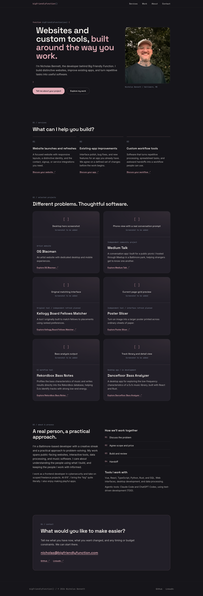

# Big Friendly Function

Nicholas Bennett’s freelance consulting portfolio for [bigfriendlyfunction.com](https://www.bigfriendlyfunction.com/). Built with Astro 4, React 18, TypeScript, and Tailwind CSS 3.

The homepage introduces website launches and refreshes, existing-app improvements, and custom workflow tools. It follows hero → services → selected projects → about/process → contact, with a real portrait, charcoal and rose styling, and a restrained function motif. Contact is a working email link, with GitHub and LinkedIn profiles.

## Site preview

[](docs/images/homepage.png)

Captured from the local production build with Playwright Chromium at 1440 × 1000, using a full-page screenshot. Regenerate with `npm run screenshot`; the image is a real rendering of the site, including its intentional project-media placeholders.

## Local setup

Use Node.js 22 LTS with npm. Python 3 is needed for the generated-page checker.

```sh
npm ci
npx playwright install chromium
npm run hooks:install
npm run dev
```

The development server normally runs at `http://localhost:4321`. Astro selects another port if that port is occupied. On Linux, Playwright may also require system packages: `npx playwright install --with-deps chromium`.

| Command | Purpose |
| --- | --- |
| `npm run dev` | Start Astro with live reload (`npm start` is an alias). |
| `npm run build` | Generate all seven static pages into `dist/`. |
| `npm run preview` | Serve the production build locally after building. |
| `npm run check` | Run TypeScript checks; this does not type-check Astro templates. |
| `npm run check:site` | Check built routes, links, headings, metadata, images, and contact links. Run after building. |
| `npm run screenshot` | Build, start a temporary local server, capture the homepage, and stop the server/browser. |
| `npm run screenshot:check` | Check that the working-copy screenshot and manifest match the current source. |
| `npm run test:hooks` | Test the screenshot guards and hook behavior in temporary Git repositories; no remote push. |
| `npm run hooks:install` | Activate the versioned Git hooks for this clone. |

There is no configured lint task. The site loads its fonts from Google Fonts, so screenshot capture needs network access for those fonts, plus the installed Playwright Chromium browser.

## Site structure and content

Astro renders the homepage and six project pages as static HTML. Only the responsive header hydrates as a React island for the mobile menu. No CMS, client-side router, or contact-form backend is required.

| Location | What to edit |
| --- | --- |
| `src/pages/index.astro` | Homepage section order. |
| `src/components/` | Header, hero, services, project gallery, about/process, contact, footer, and shared media presentation. |
| `src/data/projects.json` | Structured project copy, links, status, decisions, delivered work, plans, media, and content TODOs. |
| `src/data/projects.ts` | Media validation: absent local images fall back to a deliberate placeholder. |
| `src/pages/projects/[slug].astro` | Shared project-page template and static route generation. |
| `src/layouts/BaseLayout.astro` | Document titles, descriptions, canonical URLs, Open Graph metadata, and skip link. |
| `src/styles/global.css` | Shared styles, focus indicators, spacing, and reduced-motion behavior. |
| `tailwind.config.mjs` | Charcoal/rose palette and font tokens. |
| `public/` | Portrait, favicon, and future approved project media. |
| `docs/images/` | README screenshot and its source/image checksum manifest; these are not website assets. |
| `.githooks/` | Versioned merge and push hooks. |

Project routes:

- `/projects/og-blacman/`
- `/projects/medium-talk/`
- `/projects/kellogg-matcher/`
- `/projects/poster-slicer/`
- `/projects/rekordbox-bass-notes/`
- `/projects/dancefloor-bass-analyzer/`

Each route builds to its own `index.html`, supporting direct loads and refreshes on static hosting. The gallery and project pages use the same content. Live-site actions appear only for projects with supplied live URLs; source links are separate. Planned Kellogg and Poster Slicer refinements remain distinct from delivered work, and Dancefloor Bass Analyzer is labeled in development.

### Adding project media

1. Find the media entry in `src/data/projects.json`.
2. Put the approved image under `public` at its reserved `assetPath` (for example, `public/images/projects/og-blacman/desktop-hero.png`).
3. Set `src` to the public URL, such as `/images/projects/og-blacman/desktop-hero.png`, and supply accurate `alt` text and a factual caption.
4. Build and regenerate the README screenshot.

Keep `src: null` until an asset exists. A nonexistent local file also renders a labeled placeholder. Images preserve their aspect ratios. See [CONTENT_TODO.md](CONTENT_TODO.md) for missing screenshots, contribution details, credits, the future coworking portrait, and optional recordings. The unverified WhatsApp destination is omitted pending a verified replacement.

## Screenshot and Git workflow

Work on a dedicated feature branch and commit coherent changes. Merge into `main` only when explicitly authorized. Hook installation is local Git configuration, so run `npm run hooks:install` once per clone. The installer preserves existing hook setups by refusing to replace a different `core.hooksPath` or active default hooks.

After an authorized merge into `main`, the `post-merge` hook runs `npm run screenshot`, including after a fast-forward merge. Review the image and commit the generated files if changed:

```sh
git add docs/images/homepage.png docs/images/homepage.json
git commit -m "docs: refresh homepage screenshot"
```

Before any push targeting remote `main`, `pre-push` checks the **exact outgoing commit**, even when the local branch has another name. It requires the README image, its manifest, and matching hashes of the site source, public assets, package files, configuration, and JavaScript tooling. A missing, stale, or modified image blocks the push with regeneration instructions. Changes only to README prose do not require a new capture.

The screenshot script waits for fonts and images, disables animation, and serves only the local build on an automatically allocated port. The manifest is a freshness check, not a pixel-diff test or proof of identical rendering across machines. Review visual changes before committing.

A failed post-merge capture cannot undo a completed merge; the pre-push guard still checks freshness. Feature-branch merges and pushes are unaffected. Deleting a remote branch does not trigger screenshot validation. These local hooks do not run for merges made through a remote web interface, and Git can bypass them with `--no-verify`. Squash merges and direct edits on `main` may need a manual capture; the pre-push check still applies.

No hook commits, pushes, or deploys automatically. If a capture fails, install dependencies/browser as needed, rerun `npm run screenshot`, review and commit the image and manifest, then retry the explicitly authorized push.

The automation uses [Playwright screenshots](https://playwright.dev/docs/screenshots) and Git’s documented [post-merge and pre-push hooks](https://git-scm.com/docs/githooks).

## Hosting

`astro.config.mjs` sets `output: 'static'` and the canonical site URL to `https://bigfriendlyfunction.com`. The repository is prepared for static hosting such as Vercel: build with `npm run build` and publish `dist/`. No Vercel-specific configuration is checked in; remote deployment settings are managed separately.

Pushing and deploying require explicit authorization. If a hosting provider is connected to `main`, a push may trigger a deployment. The screenshot workflow itself does not publish anything.
